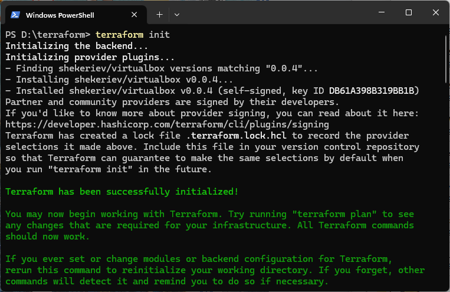

# Provisionamiento de una Máquina Virtual Ubuntu 24.04 en Virtualbox con Terraform

Este proyecto de Terraform provisiona una máquina virtual Ubuntu 24.04 en Virtualbox.

## Requisitos Previos

Asegúrate de tener los siguientes requisitos instalados en tu sistema:

* **Virtualbox:** Descarga e instala Virtualbox desde [https://www.virtualbox.org/wiki/Downloads](https://www.virtualbox.org/wiki/Downloads).
* **Terraform:** Descarga e instala Terraform desde [https://www.terraform.io/downloads](https://www.terraform.io/downloads).
* **Proveedor de Virtualbox para Terraform:** Terraform necesita el proveedor de Virtualbox para interactuar con Virtualbox. Este proyecto utiliza el proveedor `shekeriev/virtualbox`. Terraform se encargará de descargarlo automáticamente al inicializar el proyecto.

## Configuración del Proyecto

1.  **Crea un directorio para tu proyecto Terraform:**

    ```bash
    mkdir terraform
    cd terraform
    ```

2.  **Crea un archivo de configuración de Terraform (`main.tf`):**

    Crea un archivo llamado `main.tf` dentro del directorio `terraform` y pega el siguiente contenido:

    ```terraform
    terraform {
      required_providers {
        virtualbox = {
          source  = "shekeriev/virtualbox"
          version = "0.0.4"
        }
      }
    }

    provider "virtualbox" {}

    resource "virtualbox_vm" "ubuntu_server" {
      name    = "ubuntu-${formatdate("YYYYMMDD-hhmmss", timestamp())}"
      image   = "[https://cloud-images.ubuntu.com/releases/24.04/release/ubuntu-24.04-server-cloudimg-amd64.ova](https://cloud-images.ubuntu.com/releases/24.04/release/ubuntu-24.04-server-cloudimg-amd64.ova)"
      cpus    = 2
      memory  = "2048 MiB"

      network_adapter {
        type    = "nat"
      }

    }
    ```

    **Descripción del archivo `main.tf`:**

    * `terraform { required_providers { ... } }`: Especifica los proveedores que Terraform necesita para este proyecto. En este caso, se define el proveedor `virtualbox` con la fuente `shekeriev/virtualbox` y la versión `0.0.4`.
    * `provider "virtualbox" {}`: Configura el proveedor de Virtualbox. En esta configuración básica, no se necesitan parámetros adicionales si Virtualbox está en la variable de entorno `PATH` de tu sistema.
    * `resource "virtualbox_vm" "ubuntu_server" { ... }`: Define el recurso de la máquina virtual que Terraform gestionará.
        * `name`: El nombre de la máquina virtual en Virtualbox. Se utiliza una plantilla para generar un nombre único basado en la fecha y hora actual.
        * `image`: La URL de la imagen OVA de Ubuntu 24.04 Server. Virtualbox utilizará esta imagen para crear la máquina virtual.
        * `cpus`: El número de CPUs virtuales asignados a la máquina virtual (en este caso, 2).
        * `memory`: La cantidad de memoria RAM asignada a la máquina virtual (en este caso, 2048 MiB).
        * `network_adapter`: Configuración de la interfaz de red.
            * `type = "nat"`: Configura la red en modo NAT (Network Address Translation), lo que permite que la máquina virtual acceda a internet a través de la conexión del host.

## Ejecución de Terraform

1.  **Inicializa el proyecto Terraform:**

    Abre tu terminal o línea de comandos, navega al directorio `terraform` y ejecuta el siguiente comando:

    ```bash
    terraform init
    ```

    Este comando descarga y configura el proveedor de Virtualbox especificado en el archivo `main.tf`.





2.  **Planifica la creación de la máquina virtual:**

    Ejecuta el siguiente comando para ver un resumen de las acciones que Terraform realizará:

    ```bash
    terraform plan
    ```

    Revisa la salida para asegurarte de que la configuración es la esperada.

3.  **Aplica la configuración y crea la máquina virtual:**

    Ejecuta el siguiente comando para que Terraform cree la máquina virtual en Virtualbox:

    ```bash
    terraform apply -auto-approve
    ```

    El flag `-auto-approve` evita que Terraform te pida confirmación antes de realizar los cambios.

## Captura de Pantalla

Una vez que Terraform haya creado la máquina virtual, abre la interfaz de Virtualbox. Deberías ver una nueva máquina virtual llamada `ubuntu-` seguido de una marca de tiempo (por ejemplo, `ubuntu-20250519-214000`). Toma una captura de pantalla de la ventana de Virtualbox mostrando esta nueva máquina virtual.

**Nota:** En este punto, la máquina virtual se habrá creado, pero el sistema operativo Ubuntu 24.04 aún no estará configurado dentro de ella. La primera vez que inicies la máquina virtual desde Virtualbox, comenzará el proceso de instalación del sistema operativo desde la imagen OVA.