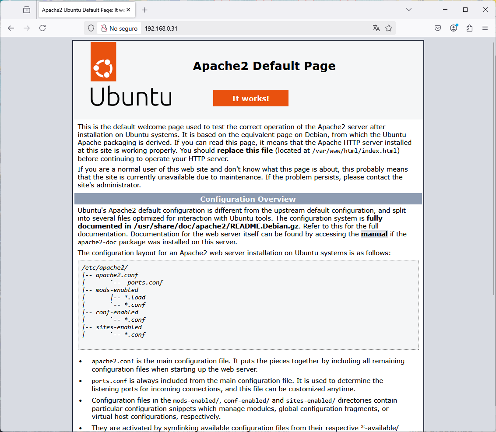

# Configuración de una Máquina Virtual Ubuntu 24.04 en Virtualbox mediante Ansible

Este documento detalla los pasos para configurar una máquina virtual Ubuntu 24.04 en Virtualbox utilizando Ansible, realizando las siguientes tareas:

* Actualización del sistema.
* Instalación del servidor web Apache.

## Prerrequisitos

* Tener Virtualbox instalado.
* Tener una máquina virtual Ubuntu 24.04 corriendo en Virtualbox con una dirección IP estática asignada (en este caso, `192.168.0.31`).
* Tener Ansible instalado en la máquina de control desde donde se ejecutará el playbook.
* Asegurarse de que la máquina de control puede conectarse a la VM de Ubuntu a través de SSH.

## Pasos

### 1. Preparar la máquina virtual Ubuntu 24.04 en Virtualbox

* **Asegúrate de que la VM de Ubuntu esté en ejecución.**

* **Configurar la red:**
    * Verifica que la VM tenga una dirección IP estática configurada como `192.168.0.31`. Esto se configura dentro de la configuración de red de la VM en Ubuntu.
    * Comprueba la conectividad desde la máquina de control usando el comando:
        ```bash
        ping 192.168.0.31
        ```

### 2. Preparar la máquina de control (donde se ejecutará Ansible)

* **Instalar Ansible:**
    * Instala Ansible en tu máquina de control. Los comandos varían según el sistema operativo:
        * **En sistemas basados en Debian/Ubuntu:**
            ```bash
            sudo apt update
            sudo apt install software-properties-common

        

            sudo apt-add-repository --yes --update ppa:ansible/ansible

        

            sudo apt install ansible

        

        
        * Para otros sistemas operativos, consulta la [documentación de Ansible](https://docs.ansible.com/installation_guide/index.html).

* **Crear los archivos de Ansible:**
    * Crea un directorio para los archivos de Ansible y, dentro de él, crea los archivos `hosts.ini` y `configure_ubuntu.yml` con el contenido proporcionado.

    * **Archivo `hosts.ini`:**
        ```ini
        [ubuntu_servers]
        ubuntu ansible_host=192.168.0.31 ansible_user=administrador

        [ubuntu_servers:vars]
        ansible_connection=ssh
        ansible_ssh_common_args='-o StrictHostKeyChecking=no'
        ```
        **Nota:** Reemplaza `administrador` con el nombre de usuario que utilizas en tu máquina virtual Ubuntu.

        


    * **Archivo `configure_ubuntu.yml`:**
        ```yaml
        ---
        - name: Configurar máquina virtual Ubuntu
          hosts: ubuntu_servers
          become: yes
          vars:
            ansible_become_ask_pass: yes

          tasks:
            - name: Actualizar la caché de paquetes
              apt:
                update_cache: yes

            - name: Realizar upgrade del sistema
              apt:
                upgrade: full

            - name: Instalar el servicio Apache2
              apt:
                name: apache2
                state: present
        ```

        

### 2. Ejecutar el Playbook de Ansible

* Desde la máquina de control, en el directorio donde guardaste los archivos, ejecuta el siguiente comando:
    ```bash
    ansible-playbook configure_ubuntu.yml -i hosts.ini -k -K
    ```
* Ansible te pedirá la contraseña para el usuario `administrador` (o el usuario configurado en `hosts.ini`) en la VM de Ubuntu.


### 3. Verificar la instalación de Apache

* **En la VM de Ubuntu:**
    * Verifica que el servicio Apache se está ejecutando:
        ```bash
        sudo systemctl status apache2
        ```


* **Desde la máquina de control:**
    * Abre un navegador web y accede a la dirección IP de la VM Ubuntu (`http://192.168.0.31`) para confirmar que la página de inicio de Apache se muestra correctamente.



Con estos pasos, habrás configurado la VM de Ubuntu utilizando Ansible.