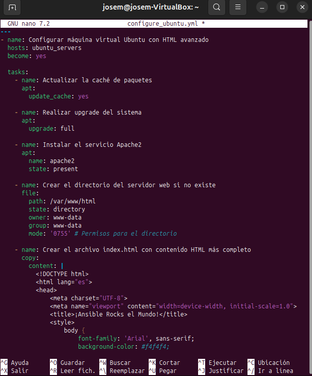
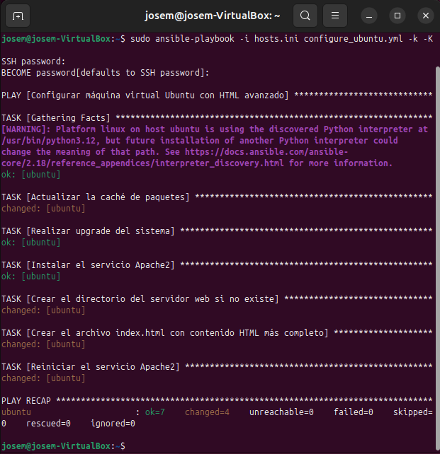
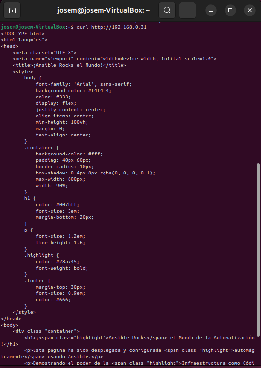
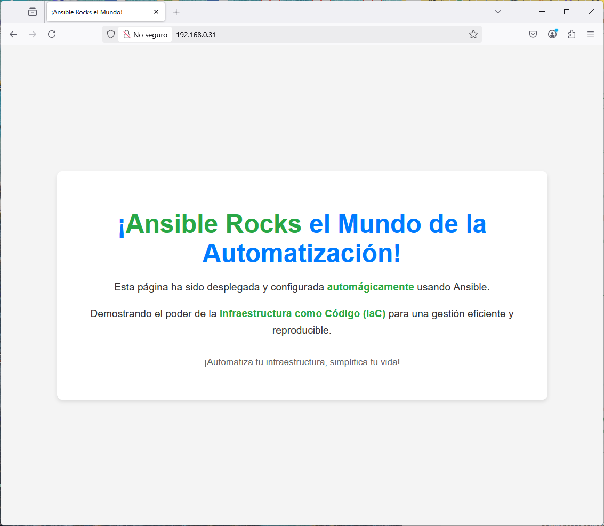

# Configuración de una Máquina Virtual Ubuntu 24.04 en Virtualbox mediante Ansible: Despliegue Web Avanzado

Este documento amplía la configuración de una máquina virtual Ubuntu 24.04 en Virtualbox utilizando Ansible. Nos enfocaremos en desplegar un sitio web con contenido HTML más completo en el servidor Apache.

---

## 3.3. Configurar una Máquina Virtual Ubuntu 24.04 en Virtualbox mediante Ansible (Despliegue Web Avanzado)

En esta sección, continuaremos trabajando en el directorio de nuestro proyecto Ansible (`ansible`) para mejorar nuestro playbook y desplegar una página web más elaborada.

### Modificación del Playbook de Ansible (`configure_ubuntu.yml`)

Hemos modificado el playbook `configure_ubuntu.yml` para incluir tareas adicionales que permitirán la creación de un directorio web y la copia de un archivo `index.html` con contenido HTML avanzado, así como el reinicio del servicio Apache.

Aquí está el contenido actualizado de tu archivo `configure_ubuntu.yml`:

```yaml
---
- name: Configurar máquina virtual Ubuntu con HTML avanzado
  hosts: ubuntu_servers
  become: yes

  tasks:
    - name: Actualizar la caché de paquetes
      apt:
        update_cache: yes

    - name: Realizar upgrade del sistema
      apt:
        upgrade: full

    - name: Instalar el servicio Apache2
      apt:
        name: apache2
        state: present

    - name: Crear el directorio del servidor web si no existe
      file:
        path: /var/www/html
        state: directory
        owner: www-data
        group: www-data
        mode: '0755' # Permisos para el directorio

    - name: Crear el archivo index.html con contenido HTML más completo
      copy:
        content: |
          <!DOCTYPE html>
          <html lang="es">
          <head>
              <meta charset="UTF-8">
              <meta name="viewport" content="width=device-width, initial-scale=1.0">
              <title>¡Ansible Rocks el Mundo!</title>
              <style>
                  body {
                      font-family: 'Arial', sans-serif;
                      background-color: #f4f4f4;
                      color: #333;
                      display: flex;
                      justify-content: center;
                      align-items: center;
                      min-height: 100vh;
                      margin: 0;
                      text-align: center;
                  }
                  .container {
                      background-color: #fff;
                      padding: 40px 60px;
                      border-radius: 10px;
                      box-shadow: 0 4px 8px rgba(0, 0, 0, 0.1);
                      max-width: 800px;
                      width: 90%;
                  }
                  h1 {
                      color: #007bff;
                      font-size: 3em;
                      margin-bottom: 20px;
                  }
                  p {
                      font-size: 1.2em;
                      line-height: 1.6;
                  }
                  .highlight {
                      color: #28a745;
                      font-weight: bold;
                  }
                  .footer {
                      margin-top: 30px;
                      font-size: 0.9em;
                      color: #666;
                  }
              </style>
          </head>
          <body>
              <div class="container">
                  <h1>¡<span class="highlight">Ansible Rocks</span> el Mundo de la Automatización!</h1>
                  <p>Esta página ha sido desplegada y configurada <span class="highlight">automágicamente</span> usando Ansible.</p>
                  <p>Demostrando el poder de la <span class="highlight">Infraestructura como Código (IaC)</span> para una gestión eficiente y reproducible.</p>
                  <div class="footer">
                      <p>¡Automatiza tu infraestructura, simplifica tu vida!</p>
                  </div>
              </div>
          </body>
          </html>
        dest: /var/www/html/index.html
        owner: www-data
        group: www-data
        mode: '0644' # Permisos para el archivo

    - name: Reiniciar el servicio Apache2
      service:
        name: apache2
        state: restarted
```



---
### Nuevas Tareas Incluidas en el Playbook

Las siguientes tareas se han añadido a `configure_ubuntu.yml` para el despliegue web avanzado:

* **`file`**: Esta tarea garantiza que el directorio `/var/www/html` exista. También configura la propiedad (`owner: www-data`, `group: www-data`) y los permisos correctos (`mode: '0755'`) para que el servidor web Apache pueda servir los archivos de forma adecuada.

* **`copy`**: Esta tarea es crucial para crear o actualizar el archivo `index.html` en el destino `/var/www/html`. El `content` especificado es una plantilla HTML completa y con estilo, lo que hace que la página sea más visualmente atractiva que un simple mensaje de texto.

* **`service`**: Después de modificar el contenido web, esta tarea gestiona el estado del servicio `apache2`, en este caso, lo **reinicia**. Esto es fundamental para que Apache recargue la configuración y sirva el nuevo archivo `index.html`.

---

### Ejecutar el Playbook de Ansible

Desde tu máquina de control, navega al directorio donde guardaste los archivos `hosts.ini` y `configure_ubuntu.yml`. Luego, ejecuta el playbook con el siguiente comando:

```bash
ansible-playbook -i hosts.ini configure_ubuntu.yml -k -K
```

* Ansible te pedirá la contraseña para el usuario configurado en tu máquina virtual Ubuntu (definido en `hosts.ini` con `ansible_user`).



### Validación (desde tu máquina local)
Para confirmar que el playbook se ejecutó correctamente y que el nuevo contenido web está disponible, abre una terminal en tu máquina local y usa `curl` para obtener el contenido del servidor web de la máquina virtual Ubuntu. Asegúrate de reemplazar `<IP_DE_TU_MAQUINA_VIRTUAL>` con la dirección IP correcta de tu VM Ubuntu (en este caso, `192.168.0.31`).

```bash
curl [http://192.168.0.31](http://192.168.0.31) 
```
* Deberías ver la salida HTML completa que definimos en el playbook, comenzando con `<!DOCTYPE html>` y conteniendo el mensaje "¡Ansible Rocks el Mundo de la Automatización!". Esto valida que Apache está sirviendo el contenido actualizado



* **Desde la máquina de control:**
    * Abre un navegador web y accede a la dirección IP de la VM Ubuntu (`http://192.168.0.31`) para confirmar que la página de inicio de Apache se muestra correctamente.



* Podemos ver la web que se ha diseñado y cargado desde ``ansible``

